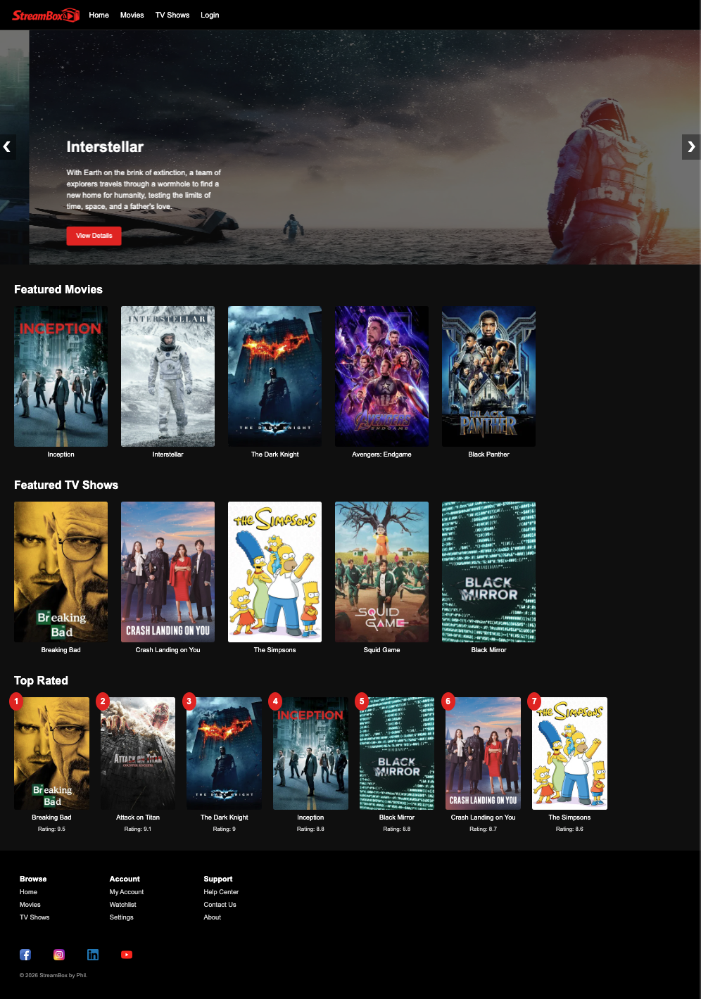
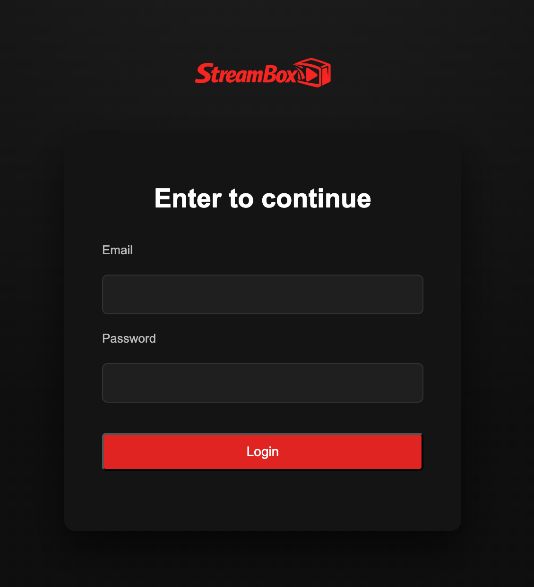
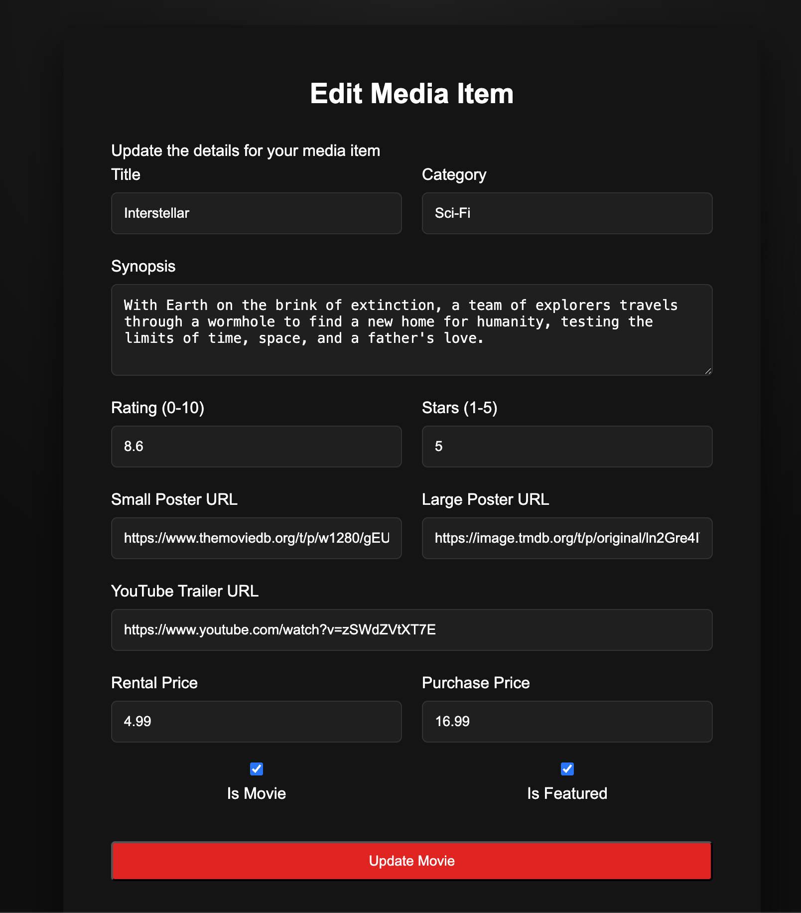

# StreamBox

StreamBox is a full-stack media web application built with **Node.js, Express, MongoDB, Mongoose, and EJS**.  
Developed as an academic project, it simulates a streaming-style platform with media browsing, session-based authentication, role-based access control, and admin CRUD workflows.

## Tech Stack

- **Backend:** Node.js, Express
- **Database:** MongoDB, Mongoose
- **Frontend / Templating:** EJS, HTML, CSS
- **Authentication:** express-session
- **Environment Management:** dotenv

## Key Features

- Browse featured movies and TV shows
- View media listing and detail pages
- Session-based login/logout
- Role-based access control for **admin** and **customer** users
- Admin-only media management:
  - Create media
  - Edit media
  - Delete media
- Seeded starter data for users and media content
- Purchase flow with purchase records stored in MongoDB

## Screenshots

### Home Page


### Login Page


### Admin Media Management


## Demo Accounts

**Admin**
- Email: `peter@gmail.com`
- Password: `1111`

**Customer**
- Email: `jane@gmail.com`
- Password: `1111`

## Run Locally

1. Install dependencies

```bash
npm install
```

2. Create a `.env` file in the project root

```env
MONGODB_URI=your_mongodb_connection_string
SESSION_SECRET="your_session_secret_here"
```

3. Start the app

```bash
npm run dev
```

or

```bash
npm start
```

4. Open in browser

```text
http://localhost:4000
```

## What I Practiced

- Building a dynamic full-stack web application
- Designing MongoDB schemas for media, users, and purchases
- Implementing session-based authentication and role-based access control
- Managing CRUD workflows and database-driven routing
- Rendering server-side views with EJS

## Notes

This project was built for academic and learning purposes.  
It is not affiliated with Netflix or any streaming platform.
